# 🏗️ Arquitetura Técnica do Sistema

> **Versão:** 1.0  
> **Stack:** React + TypeScript + Supabase + Stripe + Focus NFe  
> **Última atualização:** Janeiro 2025

---

## 📑 Índice

1. [Visão Geral](#visão-geral)
2. [Stack Tecnológico](#stack-tecnológico)
3. [Arquitetura de Autenticação](#arquitetura-de-autenticação)
4. [Fluxo de Pagamento](#fluxo-de-pagamento)
5. [Fluxo de Emissão de NFe](#fluxo-de-emissão-de-nfe)
6. [Estrutura do Banco de Dados](#estrutura-do-banco-de-dados)
7. [Edge Functions](#edge-functions)
8. [Sistema de Segurança](#sistema-de-segurança)
9. [Integrações Externas](#integrações-externas)

---

## 🎯 Visão Geral

O sistema é uma plataforma de e-commerce especializada em perfumaria fina, com foco em **decantados** (amostras) e **assinaturas mensais**. A arquitetura é serverless, utilizando Supabase como backend completo (banco de dados PostgreSQL, autenticação, storage e edge functions).

### Características Principais

- ✅ **SPA (Single Page Application)** com React + Vite
- ✅ **Serverless** com Supabase Edge Functions (Deno)
- ✅ **Real-time** via Supabase subscriptions
- ✅ **Type-safe** com TypeScript end-to-end
- ✅ **Responsive** com Tailwind CSS
- ✅ **Secure** com RLS (Row Level Security) e rate limiting
- ✅ **Compliance** com LGPD e regulamentações fiscais brasileiras

---

## 🛠️ Stack Tecnológico

### Frontend
```
React 18.3.1
TypeScript 5.x
Vite 5.x
Tailwind CSS 3.x
React Router 6.x
TanStack Query 5.x (react-query)
Zod (validação de schemas)
React Hook Form
Framer Motion (animações)
```

### Backend (Supabase)
```
PostgreSQL 15.x
PostgREST (API automática)
Supabase Auth (JWT)
Supabase Storage
Deno (Edge Functions runtime)
```

### Integrações
```
Stripe (pagamentos)
Focus NFe (notas fiscais)
Melhor Envio (logística)
Resend (emails transacionais)
Sentry (error tracking)
Google Analytics 4
```

### DevOps
```
Git + GitHub
Lovable (deployment)
Supabase Cloud
Netlify Functions (backup)
```

---

## 🔐 Arquitetura de Autenticação

### Fluxo de Login Básico

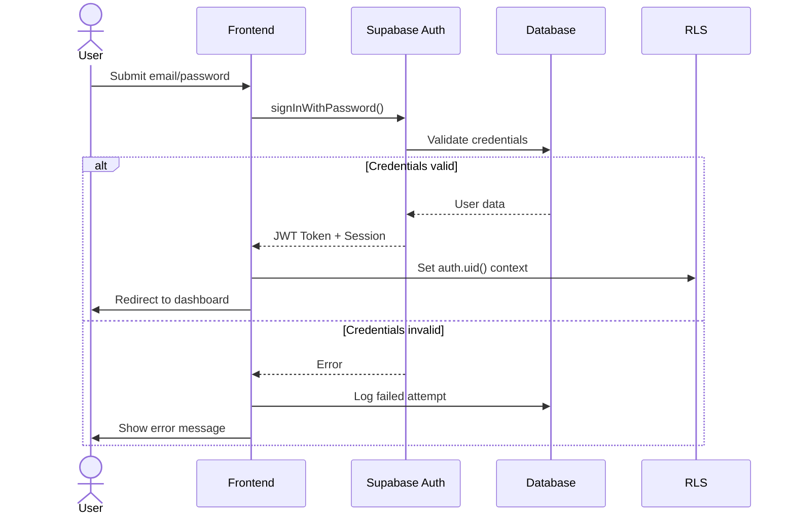

### Fluxo de Login com 2FA

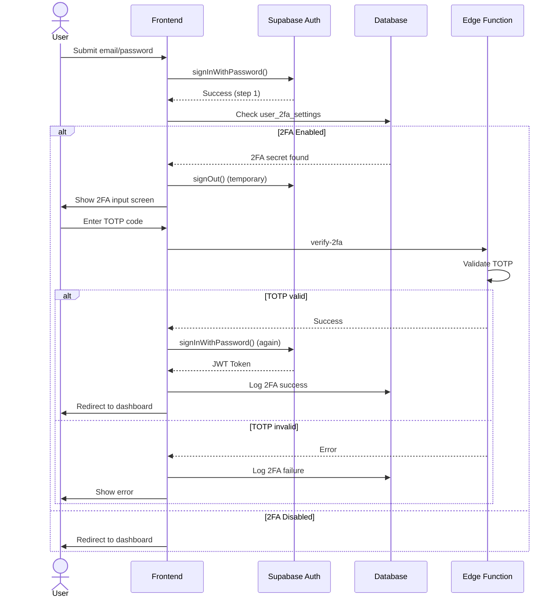

### Sistema de Roles

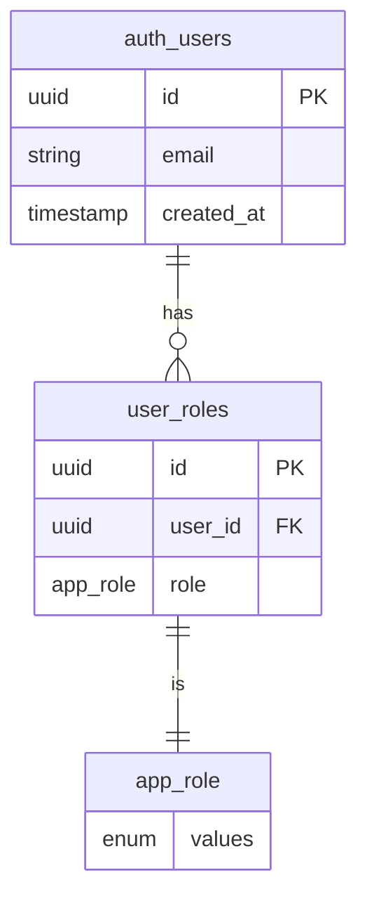

**Enum de Roles:**
```sql
CREATE TYPE app_role AS ENUM ('admin', 'moderator', 'user');
```

**Função de Verificação (Security Definer):**
```sql
CREATE FUNCTION has_role(_user_id uuid, _role app_role)
RETURNS boolean
SECURITY DEFINER
AS $$
  SELECT EXISTS (
    SELECT 1 FROM user_roles
    WHERE user_id = _user_id AND role = _role
  )
$$;
```

**Uso em RLS Policies:**
```sql
CREATE POLICY "Admins can view all orders"
ON orders FOR SELECT
USING (has_role(auth.uid(), 'admin'));
```

---

## 💳 Fluxo de Pagamento

### Pagamento com Cartão de Crédito (Stripe)

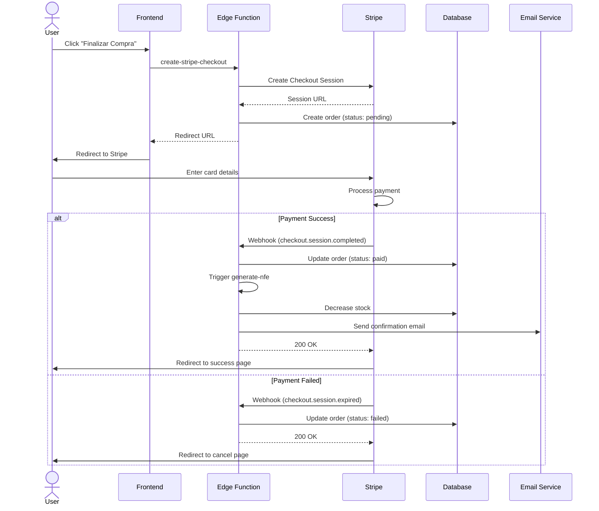

### Pagamento com PIX

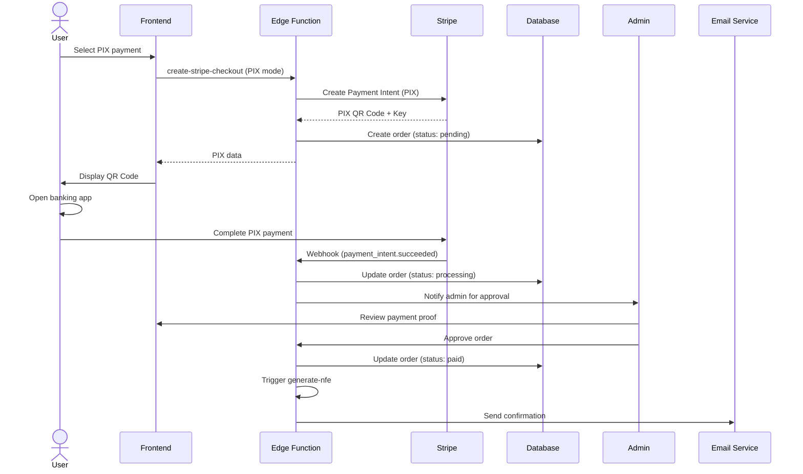

### Estados do Pedido

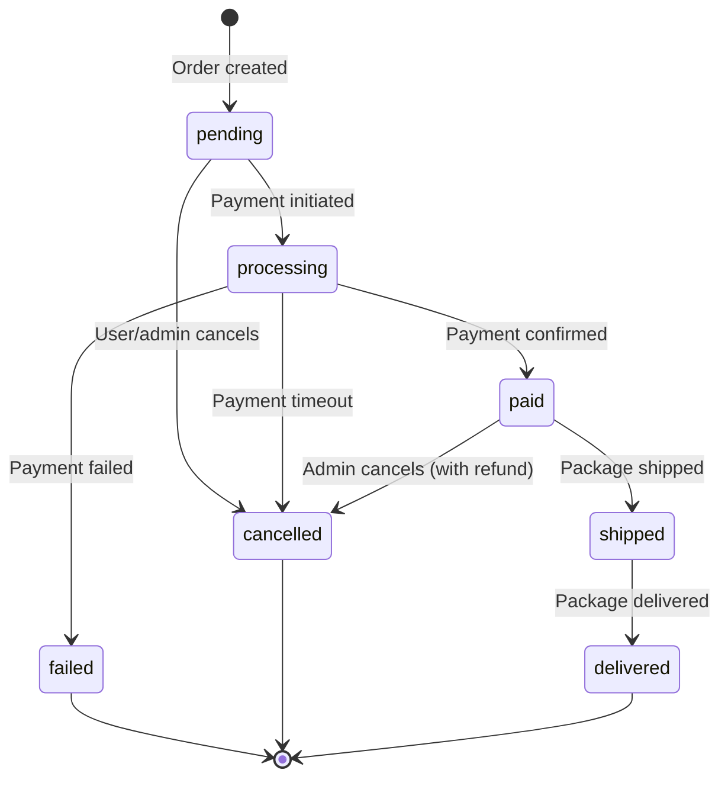

---

## 🧾 Fluxo de Emissão de NFe

### Processo Completo

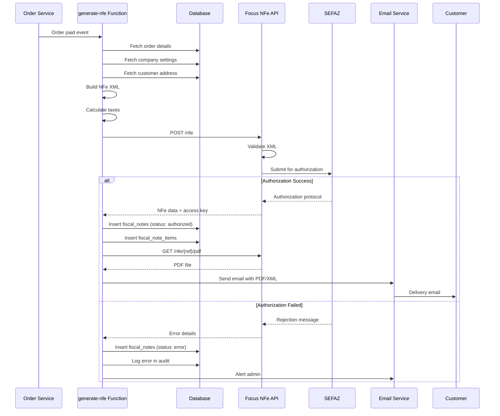

### Cancelamento de NFe

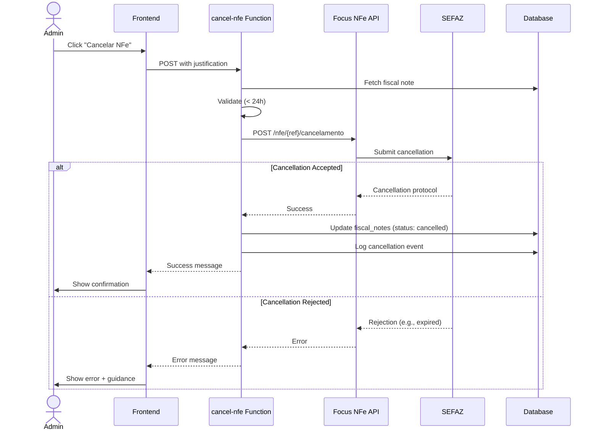

### Retry Mechanism

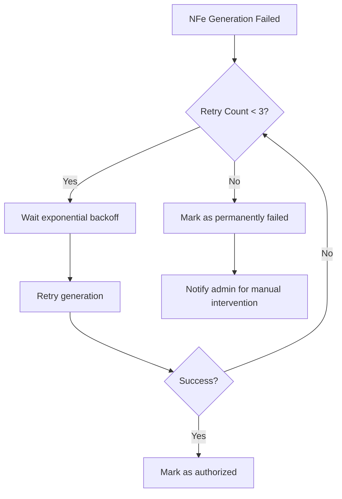

**Backoff Strategy:**
- Attempt 1: Immediate
- Attempt 2: 30 seconds
- Attempt 3: 2 minutes
- After 3 failures: Manual intervention required

---

## 🗄️ Estrutura do Banco de Dados

### Diagrama ER Principal

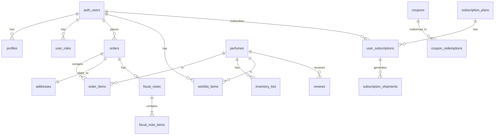

### Tabelas de Segurança

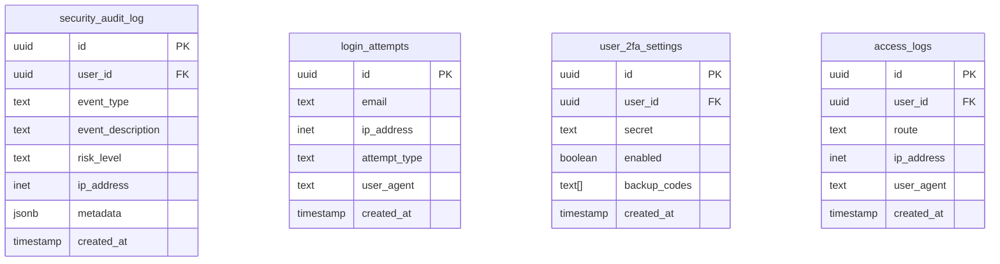

### Tabelas de Negócio

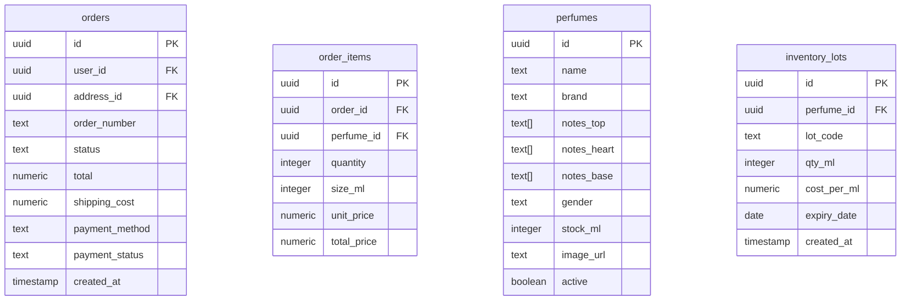

### Tabelas Fiscais

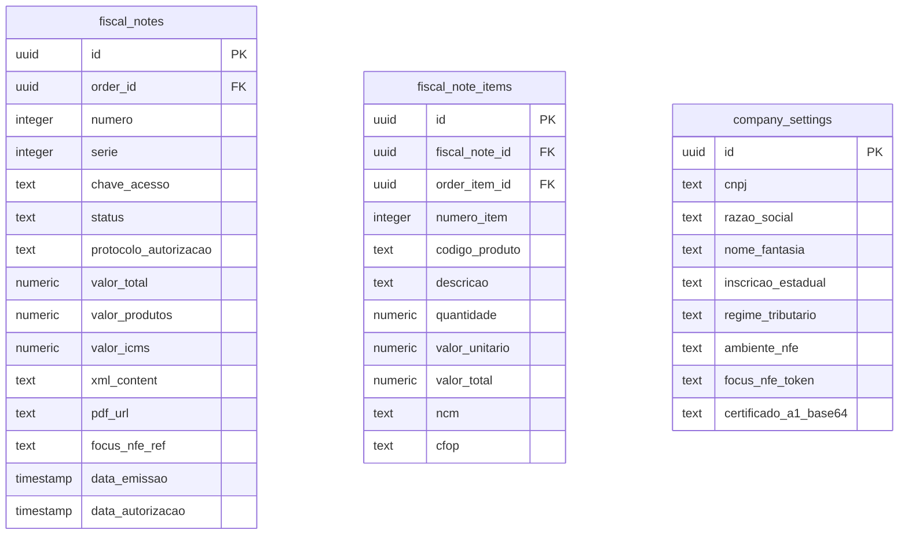

### Índices Importantes

```sql
-- Performance em queries comuns
CREATE INDEX idx_orders_user_id ON orders(user_id);
CREATE INDEX idx_orders_status ON orders(status);
CREATE INDEX idx_orders_created_at ON orders(created_at DESC);
CREATE INDEX idx_order_items_order_id ON order_items(order_id);
CREATE INDEX idx_fiscal_notes_order_id ON fiscal_notes(order_id);
CREATE INDEX idx_security_audit_risk_level ON security_audit_log(risk_level);
CREATE INDEX idx_security_audit_created_at ON security_audit_log(created_at DESC);

-- Full-text search em perfumes
CREATE INDEX idx_perfumes_search ON perfumes USING gin(to_tsvector('portuguese', name || ' ' || brand));
```

---

## ⚡ Edge Functions

### Lista Completa

| Função | Descrição | Auth | Rate Limit |
|--------|-----------|------|------------|
| `create-stripe-checkout` | Cria sessão de pagamento Stripe | ✅ | 10/min |
| `stripe-webhook` | Processa eventos Stripe | ❌ | - |
| `generate-nfe` | Emite nota fiscal via Focus NFe | ❌ | 5/min |
| `cancel-nfe` | Cancela NFe emitida | ✅ Admin | 3/min |
| `send-email` | Envia emails transacionais | ❌ | 20/min |
| `conversational-recommend` | Recomendação de perfumes via IA | ✅ | 15/min |
| `process-payment` | Processa pagamento PIX manual | ✅ Admin | 10/min |
| `validate-coupon` | Valida cupom de desconto | ✅ | 30/min |
| `shipping-quote` | Cotação de frete Melhor Envio | ✅ | 20/min |
| `confirm-order` | Confirma pedido e baixa estoque | ❌ | - |
| `verify-2fa` | Verifica código TOTP 2FA | ✅ | 5/min |
| `moderate-review` | Moderação de review com IA | ❌ | 10/min |
| `cart-recovery` | Sistema de recuperação de carrinho | ❌ | - |
| `process-monthly-subscriptions` | Processa assinaturas mensais | ❌ Cron | - |

### Estrutura de uma Edge Function

```typescript
// supabase/functions/example/index.ts
import { serve } from 'https://deno.land/std@0.168.0/http/server.ts';
import { createClient } from 'https://esm.sh/@supabase/supabase-js@2';

// CORS headers
const corsHeaders = {
  'Access-Control-Allow-Origin': '*',
  'Access-Control-Allow-Headers': 'authorization, x-client-info, apikey, content-type',
};

serve(async (req) => {
  // Handle CORS preflight
  if (req.method === 'OPTIONS') {
    return new Response('ok', { headers: corsHeaders });
  }

  try {
    // Initialize Supabase client
    const supabase = createClient(
      Deno.env.get('SUPABASE_URL') ?? '',
      Deno.env.get('SUPABASE_ANON_KEY') ?? '',
      {
        global: {
          headers: { Authorization: req.headers.get('Authorization')! },
        },
      }
    );

    // Verify authentication
    const { data: { user }, error: authError } = await supabase.auth.getUser();
    if (authError || !user) {
      throw new Error('Unauthorized');
    }

    // Business logic here
    const { data } = await req.json();
    
    // Return response
    return new Response(
      JSON.stringify({ success: true, data }),
      { headers: { ...corsHeaders, 'Content-Type': 'application/json' } }
    );
  } catch (error) {
    return new Response(
      JSON.stringify({ error: error.message }),
      { status: 400, headers: { ...corsHeaders, 'Content-Type': 'application/json' } }
    );
  }
});
```

### Secrets Management

**Secrets necessários:**
```bash
# Supabase
SUPABASE_URL=https://xxx.supabase.co
SUPABASE_ANON_KEY=eyJxxx...
SUPABASE_SERVICE_ROLE_KEY=eyJxxx... # Admin access

# Stripe
STRIPE_SECRET_KEY=sk_live_xxx
STRIPE_WEBHOOK_SECRET=whsec_xxx

# Focus NFe
FOCUS_NFE_TOKEN=xxx

# Melhor Envio
MELHOR_ENVIO_TOKEN=xxx

# Email (Resend)
RESEND_API_KEY=re_xxx

# OpenAI (para IA de recomendação)
OPENAI_API_KEY=sk-xxx

# Sentry (error tracking)
SENTRY_DSN=https://xxx@sentry.io/xxx
```

**Como adicionar secrets:**
```bash
# Via Supabase CLI
supabase secrets set STRIPE_SECRET_KEY=sk_live_xxx

# Via Dashboard
Supabase Dashboard > Project Settings > Edge Functions > Secrets
```

---

## 🔒 Sistema de Segurança

### Row Level Security (RLS)

**Conceito:** Cada query ao PostgreSQL é filtrada automaticamente baseada no usuário autenticado (`auth.uid()`).

**Exemplo de Policy:**
```sql
-- Usuários só podem ver seus próprios pedidos
CREATE POLICY "Users can view own orders"
ON orders FOR SELECT
USING (auth.uid() = user_id);

-- Admins podem ver todos os pedidos
CREATE POLICY "Admins can view all orders"
ON orders FOR SELECT
USING (has_role(auth.uid(), 'admin'));
```

### Rate Limiting

**Implementação:** Supabase + Custom middleware

**Limites padrão:**
```typescript
const RATE_LIMITS = {
  'checkout': { requests: 5, window: 60 }, // 5 req/min
  'login': { requests: 10, window: 300 }, // 10 req/5min
  'api': { requests: 100, window: 60 }, // 100 req/min
  'heavy': { requests: 3, window: 300 }, // 3 req/5min (NFe, etc.)
};
```

**Tabela de tracking:**
```sql
CREATE TABLE rate_limit_log (
  id uuid PRIMARY KEY DEFAULT gen_random_uuid(),
  identifier text NOT NULL, -- IP ou user_id
  endpoint text NOT NULL,
  request_count integer DEFAULT 1,
  window_start timestamp DEFAULT now(),
  blocked boolean DEFAULT false
);
```

### CSRF Protection

**Implementação:** Token em sessão + validação

```typescript
// Hook: useCSRFToken
export const useCSRFToken = () => {
  const [token, setToken] = useState<string>('');

  useEffect(() => {
    const storedToken = sessionStorage.getItem('csrf_token');
    if (!storedToken) {
      const newToken = generateRandomToken();
      sessionStorage.setItem('csrf_token', newToken);
      setToken(newToken);
    } else {
      setToken(storedToken);
    }
  }, []);

  return token;
};

// Validação no backend
const validateCSRF = (reqToken: string, sessionToken: string) => {
  if (reqToken !== sessionToken) {
    throw new Error('CSRF token invalid');
  }
};
```

### Input Validation (Zod)

**Schemas centralizados:**
```typescript
// utils/validationSchemas.ts
import { z } from 'zod';

export const signInSchema = z.object({
  email: z.string().email('Email inválido'),
  password: z.string().min(8, 'Mínimo 8 caracteres'),
});

export const orderSchema = z.object({
  items: z.array(z.object({
    perfume_id: z.string().uuid(),
    quantity: z.number().int().positive(),
    size_ml: z.number().int().positive(),
  })),
  address_id: z.string().uuid(),
  payment_method: z.enum(['credit_card', 'pix']),
});
```

**Uso:**
```typescript
const handleSubmit = async (data: unknown) => {
  const validated = signInSchema.parse(data); // Throws se inválido
  await login(validated);
};
```

### Audit Log

**Eventos registrados:**
- Login/logout
- Alteração de senha
- Criação/edição/deleção de registros sensíveis
- Acesso a dados de outros usuários (admin)
- Exportação de dados
- Alterações em configurações de pagamento
- Emissão/cancelamento de NFe

**Estrutura:**
```typescript
interface AuditLog {
  id: string;
  user_id: string;
  event_type: string;
  event_description: string;
  risk_level: 'low' | 'medium' | 'high' | 'critical';
  ip_address: string;
  user_agent: string;
  metadata: Record<string, any>;
  created_at: string;
}
```

---

## 🔗 Integrações Externas

### Stripe

**Propósito:** Processamento de pagamentos (cartão e PIX)

**Webhooks implementados:**
```typescript
const STRIPE_EVENTS = [
  'checkout.session.completed',
  'checkout.session.expired',
  'payment_intent.succeeded',
  'payment_intent.payment_failed',
  'charge.refunded',
];
```

**Fluxo de Webhook:**
1. Stripe envia evento para `/functions/v1/stripe-webhook`
2. Função valida assinatura (security)
3. Processa evento baseado no tipo
4. Atualiza ordem/pagamento no banco
5. Dispara edge functions subsequentes (NFe, email)
6. Retorna 200 OK para Stripe

### Focus NFe

**Propósito:** Emissão e cancelamento de notas fiscais eletrônicas

**Endpoints usados:**
```
POST /v2/nfes - Criar NFe
GET /v2/nfes/{ref} - Consultar NFe
POST /v2/nfes/{ref}/cancelamento - Cancelar NFe
GET /v2/nfes/{ref}/download - Baixar PDF
```

**Autenticação:** Bearer token no header

**Ambientes:**
- Homologação: testes sem valor fiscal
- Produção: NFe válidas legalmente

### Melhor Envio

**Propósito:** Cotação e compra de fretes

**Endpoints usados:**
```
POST /api/v2/me/shipment/calculate - Cotação
POST /api/v2/me/cart - Adicionar ao carrinho
POST /api/v2/me/shipment/checkout - Comprar frete
POST /api/v2/me/shipment/print - Imprimir etiqueta
```

**Fluxo:**
1. Cliente finaliza checkout
2. Sistema calcula frete via Melhor Envio
3. Exibe opções (PAC, SEDEX, etc.)
4. Cliente escolhe
5. Após pagamento, sistema compra frete automaticamente
6. Etiqueta gerada e disponibilizada para admin

### Resend

**Propósito:** Envio de emails transacionais

**Templates implementados:**
- Confirmação de pedido
- NFe emitida (com anexos PDF/XML)
- Pedido enviado (com código de rastreamento)
- Recuperação de carrinho abandonado
- Confirmação de assinatura
- Alerta de segurança (para admins)

**Estrutura:**
```typescript
interface EmailPayload {
  to: string | string[];
  from: string;
  subject: string;
  html: string;
  attachments?: Array<{
    filename: string;
    content: Buffer;
  }>;
}
```

---

## 📊 Monitoramento e Observabilidade

### Sentry (Error Tracking)

**Eventos capturados:**
- Erros JavaScript no frontend
- Exceções não tratadas em edge functions
- Falhas de integração externa
- Problemas de performance

**Configuração:**
```typescript
import * as Sentry from '@sentry/react';

Sentry.init({
  dsn: import.meta.env.VITE_SENTRY_DSN,
  environment: import.meta.env.MODE,
  tracesSampleRate: 0.1, // 10% de transações rastreadas
});
```

### Google Analytics 4

**Eventos rastreados:**
- Pageviews
- Adições ao carrinho
- Início de checkout
- Compras concluídas
- Buscas
- Interações com recomendações de IA

**Implementação:**
```typescript
import { initGA4 } from '@/utils/analytics';

// Inicializa GA4
initGA4('G-XXXXXXXXXX');

// Rastreamento de evento
gtag('event', 'purchase', {
  transaction_id: order.id,
  value: order.total,
  currency: 'BRL',
  items: order.items,
});
```

### Performance Monitoring

**Métricas coletadas:**
- LCP (Largest Contentful Paint)
- FID (First Input Delay)
- CLS (Cumulative Layout Shift)
- TTFB (Time to First Byte)
- Tempo de resposta de edge functions

**Ferramenta:** `@/utils/performanceMonitor.ts`

---

## 🚀 Deploy e CI/CD

### Ambiente de Desenvolvimento

```bash
# Instalar dependências
npm install

# Rodar localmente
npm run dev

# Rodar edge functions localmente
supabase functions serve

# Rodar testes
npm run test
```

### Ambiente de Produção

**Deploy Frontend:**
- Plataforma: Lovable/Netlify
- Branch: `main`
- Build command: `npm run build`
- Deploy automático em push

**Deploy Edge Functions:**
```bash
# Via Supabase CLI
supabase functions deploy

# Individual
supabase functions deploy generate-nfe
```

**Configuração de Secrets:**
```bash
supabase secrets set --env-file .env.production
```

### Checklist de Deploy

- [ ] Testes passando
- [ ] Build sem erros
- [ ] Secrets configurados
- [ ] RLS policies ativas
- [ ] Rate limiting configurado
- [ ] Webhooks apontando para produção
- [ ] DNS configurado
- [ ] SSL ativo
- [ ] Monitoramento ativo
- [ ] Backups configurados

---

## 📚 Recursos Adicionais

### Documentação Externa

- [Supabase Docs](https://supabase.com/docs)
- [Stripe API Reference](https://stripe.com/docs/api)
- [Focus NFe Docs](https://focusnfe.com.br/doc/)
- [Melhor Envio API](https://docs.melhorenvio.com.br/)
- [React Query](https://tanstack.com/query/latest/docs/react/overview)

### Padrões de Código

**Estrutura de pastas:**
```
src/
├── components/        # Componentes React
│   ├── ui/           # Componentes UI base (shadcn)
│   ├── admin/        # Componentes admin
│   └── ...
├── hooks/            # Custom hooks
├── pages/            # Páginas (rotas)
├── utils/            # Utilitários
├── types/            # TypeScript types
├── contexts/         # React contexts
└── integrations/     # Integrações (Supabase client)
```

**Convenções:**
- Componentes: PascalCase
- Hooks: camelCase com prefixo `use`
- Constantes: UPPER_SNAKE_CASE
- Variáveis: camelCase
- Arquivos: kebab-case

---

## 🎉 Conclusão

Esta arquitetura foi desenhada para ser:
- ✅ **Escalável:** Serverless permite scaling automático
- ✅ **Segura:** RLS + 2FA + rate limiting + audit log
- ✅ **Maintainable:** Type-safe, bem documentada, padrões claros
- ✅ **Compliant:** LGPD + regulamentações fiscais brasileiras
- ✅ **Observável:** Logs, métricas, error tracking

Para dúvidas técnicas ou sugestões de arquitetura, contate o time de desenvolvimento.

---

**Versão:** 1.0 | **Última atualização:** Janeiro 2025
